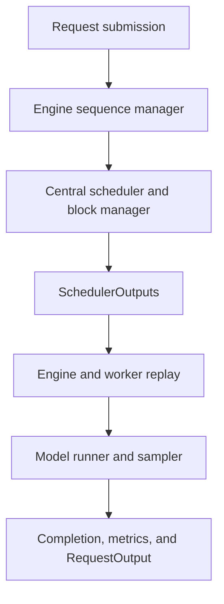
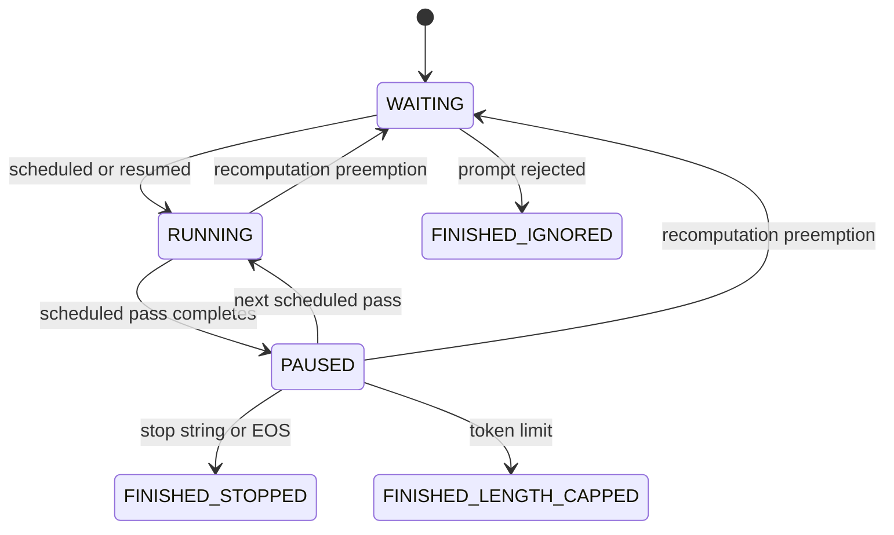
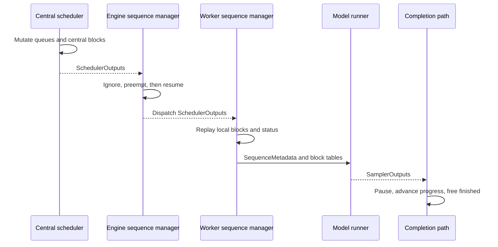
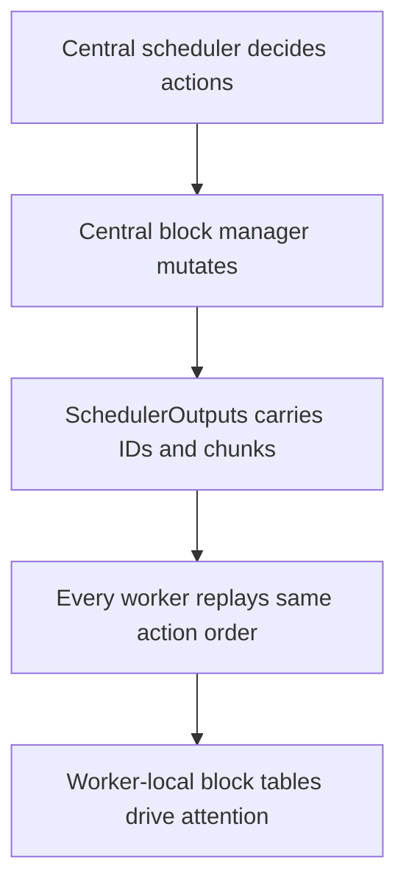
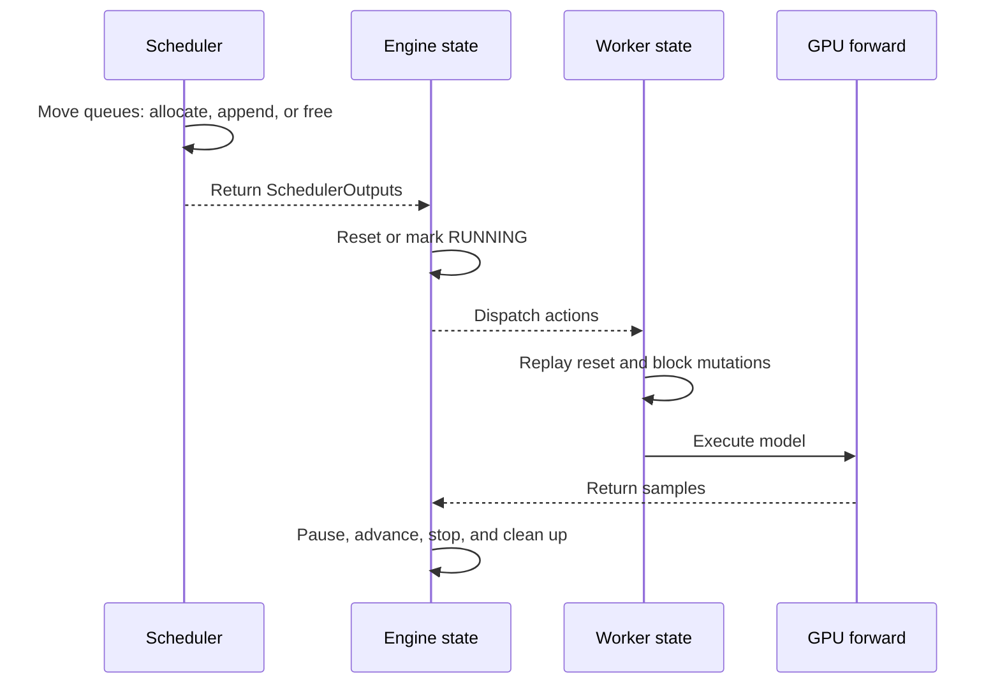
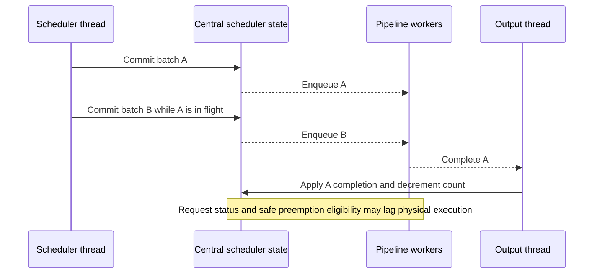

# LPServe Scheduler Architecture

**Phase C code-grounded architecture audit**  
**Audited repository:** [`AtivJoshi/LPServe`](https://github.com/AtivJoshi/LPServe)  
**Audited commit:** [`c3e014363dd50e1830d7c85c3d043eab69fdc9e5`](https://github.com/AtivJoshi/LPServe/commit/c3e014363dd50e1830d7c85c3d043eab69fdc9e5) (`gitignore update`, 2026-09-02)  
**Document role:** descriptive framework reference, not an LP-scheduler design  
**Audit method:** read-only source inspection plus the previously completed Phase B observations explicitly identified below

## Table of contents

1. [Purpose and document boundary](#1-purpose-and-document-boundary)
2. [Audit scope, revision, and evidence policy](#2-audit-scope-revision-and-evidence-policy)
3. [Terminology bridge to the updated mathematical sources](#3-terminology-bridge-to-the-updated-mathematical-sources)
4. [High-level LPServe execution architecture](#4-high-level-lpserve-execution-architecture)
5. [Scheduler configuration and policy selection](#5-scheduler-configuration-and-policy-selection)
6. [`Sequence`, `SequenceState`, and request data](#6-sequence-sequencestate-and-request-data)
7. [Request lifecycle and status transitions](#7-request-lifecycle-and-status-transitions)
8. [Queue, collection, and residency ownership](#8-queue-collection-and-residency-ownership)
9. [`BaseScheduler` responsibilities](#9-basescheduler-responsibilities)
10. [VLLM-, Sarathi-, and SLAI-named policy behavior](#10-vllm--sarathi--and-slai-named-policy-behavior)
11. [`SequenceScheduleMetadata` and `SchedulerOutputs`](#11-sequenceschedulemetadata-and-scheduleroutputs)
12. [Scheduler-to-engine-to-worker execution flow](#12-scheduler-to-engine-to-worker-execution-flow)
13. [Central and worker block-manager replay](#13-central-and-worker-block-manager-replay)
14. [Block allocation, append, free, and watermark behavior](#14-block-allocation-append-free-and-watermark-behavior)
15. [Exact native action traces](#15-exact-native-action-traces)
16. [Mutation timing and lack of transactionality](#16-mutation-timing-and-lack-of-transactionality)
17. [Pipeline-parallel behavior and in-flight ambiguity](#17-pipeline-parallel-behavior-and-in-flight-ambiguity)
18. [Mixed-batch ordering and sampler association](#18-mixed-batch-ordering-and-sampler-association)
19. [Metrics semantics](#19-metrics-semantics)
20. [Verified defect: recomputation and output generation](#20-verified-defect-recomputation-and-output-generation)
21. [Verified defect: control-only scheduler outputs](#21-verified-defect-control-only-scheduler-outputs)
22. [Complete invariant and gap matrix](#22-complete-invariant-and-gap-matrix)
23. [Framework facts relevant to mathematical state mapping](#23-framework-facts-relevant-to-mathematical-state-mapping)
24. [Testing and validation baseline](#24-testing-and-validation-baseline)
25. [Source-file and function index](#25-source-file-and-function-index)
26. [Unresolved architecture and research questions](#26-unresolved-architecture-and-research-questions)
27. [Audit limitations and deferred work](#27-audit-limitations-and-deferred-work)
28. [Compact findings summary](#28-compact-findings-summary)

## 1. Purpose and document boundary

This document records how the scheduler-relevant portion of the audited LPServe/SLAI-derived framework works. It consolidates the completed Phase C audit into a durable reference for later mathematical design, implementation, validation, and experiment work.

The document is intentionally descriptive. It explains the state and control flow that existed at the audited commit, including defects and ambiguities. It does **not**:

- specify the proposed LP scheduler;
- choose utility functions, solver policy, tolerances, tie-breaking rules, memory reserves, or fallback behavior;
- propose or implement fixes;
- claim that the audited behavior is correct merely because it is present in code;
- describe current upstream vLLM;
- claim to describe every version of Sarathi, Sarathi-Serve, SLAI, or LPServe;
- make performance claims about paths that were not benchmarked.

The future `lp_scheduler_design.md` should be normative: it should state what the new scheduler must do. This document is evidentiary: it states what the audited framework does and where its contracts are incomplete.

## 2. Audit scope, revision, and evidence policy

### 2.1 Fixed revision

Every repository statement in this document refers to the exact commit:

```text
c3e014363dd50e1830d7c85c3d043eab69fdc9e5
```

GitHub reports this commit as `gitignore update`. Commit-pinned links are used throughout so that later repository changes do not silently alter the evidence.

### 2.2 Principal source files

The audit covered the following scheduler-critical areas:

- scheduler configuration and registration;
- `BaseScheduler`, `VLLMScheduler`, `SarathiScheduler`, and `SLAIScheduler`;
- `Sequence`, `SequenceState`, `SequenceStatus`, `SequenceScheduleMetadata`, and `SchedulerOutputs`;
- central and worker sequence managers;
- block allocation, append, free, and watermark behavior;
- single-stage and pipeline-parallel engines;
- workers, model-input preparation, attention metadata, and sampling;
- request-output generation and metrics;
- repository test layout and declared dependencies.

Section 25 gives the complete source-file and function index.

### 2.3 Evidence labels

The following labels are used deliberately.

| Label | Meaning |
|---|---|
| **Verified from code** | Directly established by the audited source at the pinned commit. |
| **Verified observation** | Established by output observed during an earlier project phase; not generalized beyond that observation. |
| **Architectural synthesis** | A composition of multiple verified code paths into a diagram or end-to-end trace. Every constituent edge is code-grounded, but the diagram itself does not exist in the repository. |
| **Inference** | A consequence strongly suggested by verified code, but not demonstrated by an executed test during the audit. |
| **Approved mathematical decision** | A decision now present in the updated `main.tex` and `LP Scheduler Research Context.md`. It is not presented as pre-existing framework behavior. |
| **Unresolved research decision** | A choice that the audit could not derive from LPServe and that must be made explicitly elsewhere. |
| **Deferred implementation work** | Work intentionally outside the read-only Phase C audit. |

### 2.4 Evidence limitations

Phase C was a source audit. No serving code was changed. The repository contained no test-like files, and the audited paths were not all exercised by new unit or GPU tests. Accordingly, a code-path defect means that the inspected control/data flow is internally inconsistent; it does not imply that every deployment necessarily triggers the path.

## 3. Terminology bridge to the updated mathematical sources

The mathematical documents were revised after Phase C. Three approved changes affect the vocabulary used when connecting this architecture to later LP work.

### 3.1 Continuous prefill variable in the relaxation

**Approved mathematical decision:** the integer formulation has $x_i\in\mathbb Z_{\ge 0}$, while the LP relaxation explicitly uses $x_i\in\mathbb R_{\ge 0}$. The audited framework has no `x_i` variable or solver representation. Its concrete equivalent is a positive integer `prompt_chunk_len` in `SequenceScheduleMetadata`.

### 3.2 Legally preemptible subset

**Approved mathematical decision:**

$$
\mathcal Z_t
=
\{i\in U_t : i\text{ is resident and legally preemptible at the beginning of step }t\}.
$$

The relaxation and extracted plan must force $z_i=0$ for $i\notin\mathcal Z_t$.

**Verified framework facts relevant to this definition:** `_preempt` and `_preempt_seq` require `seq.is_executing()`, where `is_executing()` accepts `RUNNING` or `PAUSED`; useful preemption also requires an allocated physical block table; and pipeline execution makes the safety of preempting an in-flight request ambiguous. The framework does not compute or expose a canonical `preemptible` field.

### 3.3 Fixed prefill admission cost

**Approved mathematical decision:** the planning-memory term is $a_i^P I_i^P$, not a token-linear term $c_i^P x_i$.

**Verified framework behavior supporting this change:** the common block manager allocates `len(seq.logical_token_blocks)` physical blocks on first admission or recomputation, independently of the positive chunk length. A resident partial prefill already has those blocks, so scheduling another prompt chunk ordinarily allocates no additional block.

Thus, for the later mathematical mapping:

$$
a_i^P(t)=
\begin{cases}
0, & \text{resident and already allocated partial prefill},\\
|\texttt{logical\_token\_blocks}_i|, & \text{waiting or recomputation admission}.
\end{cases}
$$

This terminology bridge does not assert that the audited schedulers solve this formulation. They do not.

## 4. High-level LPServe execution architecture

LPServe uses a central engine process plus one or more GPU workers. The engine owns the authoritative scheduler, an engine-side sequence manager, and central metrics. Each worker owns a serialized copy of every sequence, a worker-local sequence manager, and a worker-local block manager. The central and worker block managers are intended to remain synchronized by replaying the same scheduling output rather than transmitting block tables every step.



**Diagram classification:** architectural synthesis. Each edge is directly grounded in `BaseLLMEngine.add_request`, `BaseScheduler.schedule`, `BaseSequenceManager.on_schedule`, `BaseWorker.execute_model`, and `BaseLLMEngine._on_step_completed`.

The core control object is `SchedulerOutputs`. It tells the engine and every worker which request IDs were ignored, which were preempted, and which received an execution action. It does not contain a snapshot of all scheduler state, a transaction identifier beyond the iteration ID, or the central block tables.

### 4.1 Request creation and replication

`BaseLLMEngine.add_request` creates one central `Sequence`. It then:

1. adds that object to the engine `EngineSequenceManager`;
2. sends the sequence to every worker, which receives its own serialized copy;
3. adds the central object to the scheduler's `waiting` list;
4. records request-arrival metrics.

**Verified from code:** the central scheduler and central engine sequence manager refer to the same in-process `Sequence` object. Workers maintain separate copies.

### 4.2 Scheduling and execution

For a normal scheduled batch:

1. the scheduler chooses actions and mutates its queues and central block manager;
2. the engine replays `SchedulerOutputs` into the engine sequence manager;
3. workers replay the same output into their sequence managers and local block managers;
4. workers prepare model inputs and run the forward pass;
5. the sampler produces `SamplerOutput` objects;
6. workers and the engine apply completion bookkeeping;
7. the scheduler frees finished central block tables and removes finished requests from `running`.

The important ordering fact is that queue, status, and block-manager mutations begin before the forward pass. Section 16 analyzes the consequences.

## 5. Scheduler configuration and policy selection

### 5.1 Configuration hierarchy

[`BaseSchedulerConfig`](https://github.com/AtivJoshi/LPServe/blob/c3e014363dd50e1830d7c85c3d043eab69fdc9e5/sarathi/config.py) stores:

- `max_num_seqs`;
- `max_model_len`;
- `num_pipeline_stages`.

Its `max_num_batched_tokens` and `type` properties are placeholders. Concrete configurations supply their meanings.

| Configuration | Primary per-step quantity | Meaning in the audited code |
|---|---|---|
| `VLLMSchedulerConfig` | `max_num_batched_tokens` | Counts prompt tokens admitted from `waiting`; decode actions are not charged to it. It is at least `max_model_len`. |
| `SarathiSchedulerConfig` | `chunk_size`, or dynamic current chunk size | Bounds combined scheduled prefill tokens and one token per decode in the concrete scheduling loop. The property returns `high_chunk_size` when dynamic chunking is enabled. |
| `SLAISchedulerConfig` | `token_budget` | Bounds combined prompt-chunk tokens and one token per scheduled decode. |
| `SLAISchedulerConfig` | `limit_total_decodes` | Separately caps scheduled critical plus noncritical decodes. |

**Verified from code:** these are distinct accounting regimes despite sharing the `max_num_batched_tokens` interface.

### 5.2 Registration

[`SchedulerRegistry`](https://github.com/AtivJoshi/LPServe/blob/c3e014363dd50e1830d7c85c3d043eab69fdc9e5/sarathi/core/scheduler/scheduler_registry.py) maps `SchedulerType` values to concrete classes. [`BlockSpaceManagerRegistry`](https://github.com/AtivJoshi/LPServe/blob/c3e014363dd50e1830d7c85c3d043eab69fdc9e5/sarathi/core/block_space_manager/block_space_manager_registry.py) separately maps the same scheduler type to a block-manager class.

The VLLM, Sarathi, and SLAI block-manager classes ultimately share `BaseBlockSpaceManager` behavior at this commit: `SarathiBlockSpaceManager` subclasses `VLLMBlockSpaceManager` without overriding methods, and `SLAIBlockSpaceManager` subclasses `SarathiBlockSpaceManager` without overriding methods.

### 5.3 Pipeline gating

`BaseScheduler.schedule` increments `_iteration_id`, then returns an empty output if:

```text
num_running_batches >= num_pipeline_stages
```

After `_schedule`, it increments `num_running_batches` only when `SchedulerOutputs.is_empty()` is false. Since `is_empty()` checks only the scheduled-metadata list, control-only outputs do not consume a running-batch slot.

## 6. `Sequence`, `SequenceState`, and request data

### 6.1 `Sequence`

[`Sequence`](https://github.com/AtivJoshi/LPServe/blob/c3e014363dd50e1830d7c85c3d043eab69fdc9e5/sarathi/core/datatypes/sequence.py) combines several logically different kinds of state:

| Category | Important fields |
|---|---|
| Immutable/request input in the normal path | `seq_id`, `prompt`, `block_size`, `eos_token_id`, `arrival_time`, `sampling_params` |
| Mutable token context | `prompt_token_ids`, `output_token_ids`, `logical_token_blocks` |
| Prompt progress | `prompt_tokens_processed`, `prompt_processing_finished` |
| Text output | `output_text`, incremental-detokenization offsets and token cache |
| SLAI request metadata | `last_schedulable_time`, per-request TBT/deadline/priority-related fields, optional oracle decode length |
| Lifecycle and metrics | `state: SequenceState` |

`logical_token_blocks` are created from the entire prompt at construction time. Every generated token is also appended to these logical blocks. Logical blocks therefore represent the full current model context, not only the prefix already processed by the GPU.

### 6.2 Prompt and output progress

The exact remaining prompt work is:

$$
P_i^{\mathrm{rem}}(t)
=
\texttt{get\_prompt\_len()}
-
\texttt{get\_num\_prompt\_tokens\_processed()}.
$$

`update_prompt_tokens_processed(n)` requires `n > 0`, prevents progress beyond `len(prompt_token_ids)`, and sets `prompt_processing_finished` when equality is reached. `append_token_id` requires prompt completion, appends to both `output_token_ids` and the logical blocks, and increments the cumulative output-token counter in `SequenceState`.

### 6.3 `SequenceState`

[`SequenceState`](https://github.com/AtivJoshi/LPServe/blob/c3e014363dd50e1830d7c85c3d043eab69fdc9e5/sarathi/core/datatypes/sequence_state.py) stores status, first-scheduling and completion timestamps, prompt-completion time, execution and non-executing intervals, cumulative output-token count, and pause/restart counts.

Two different output counts coexist:

- `Sequence.get_output_len()` is `len(output_token_ids)` and is reset by recomputation;
- `SequenceState.num_output_tokens` is cumulative and is not reset by recomputation.

This distinction is central to the defect in Section 20.

## 7. Request lifecycle and status transitions

[`SequenceStatus`](https://github.com/AtivJoshi/LPServe/blob/c3e014363dd50e1830d7c85c3d043eab69fdc9e5/sarathi/core/datatypes/sequence_status.py) defines:

- `WAITING`;
- `RUNNING`;
- `PAUSED`;
- `FINISHED_STOPPED`;
- `FINISHED_LENGTH_CAPPED`;
- `FINISHED_IGNORED`.

There is no `PREEMPTED` or `SWAPPED` status.



**Diagram classification:** verified from code. These are the transitions accepted by `SequenceState.set_status` and exercised by the sequence-manager path. Finished states have no outgoing transition handler.

Important consequences:

- `is_executing()` means status `RUNNING` **or** `PAUSED`; it is broader than `is_running()`.
- A successful scheduled pass first changes the sequence to `RUNNING`; completion changes it to `PAUSED` before applying prompt progress or a sampled token.
- A preemption changes an executing sequence to `WAITING` only when the engine/worker sequence managers replay `preempted_seq_ids`. `BaseScheduler._preempt` itself does not change status.
- An ignored request is changed directly from `WAITING` to `FINISHED_IGNORED` inside the scheduler's prompt-length check.

## 8. Queue, collection, and residency ownership

### 8.1 Base collections

`BaseScheduler` owns two lists:

- `waiting`: sequences awaiting admission or returned for recomputation;
- `running`: sequences treated by the concrete policy as resident/current.

`add_seq` appends to `waiting`. Base `has_unfinished_seqs` and `get_num_unfinished_seqs` inspect only these two lists.

### 8.2 Collection membership is not status

The scheduler and sequence manager divide responsibility:

- concrete schedulers move objects between collections;
- sequence managers change most statuses after receiving `SchedulerOutputs`;
- the scheduler and engine sequence manager share the same central `Sequence`, so engine status changes become visible through scheduler-held references;
- workers replay those changes on separate copies.

**Verified from code:** no general invariant checker establishes that every non-finished sequence has exactly one scheduler owner, that collection membership agrees with status, or that block allocation agrees with either.

### 8.3 SLAI auxiliary ownership

[`SLAIScheduler`](https://github.com/AtivJoshi/LPServe/blob/c3e014363dd50e1830d7c85c3d043eab69fdc9e5/sarathi/core/scheduler/slai_scheduler.py) additionally owns:

- `_active_seq_ids`: IDs counted against its active/resident cap;
- `paused_prefills`: allocated partial-prefill sequences awaiting another prompt chunk;
- `decode_queue`: a heap of decode sequences keyed by last-schedulable time and arrival time;
- current-batch `running`, rebuilt during every `_schedule` call.

`_post_batch_processing` transfers the previous batch's unfinished members into `paused_prefills` or `decode_queue`. Consequently, for SLAI, `running` alone is not the resident set and `waiting ∪ running` is not necessarily the full unfinished set at all instants.

**Verified gap:** inherited `has_unfinished_seqs` and `get_num_unfinished_seqs` do not inspect `paused_prefills`, `decode_queue`, or `_active_seq_ids`. If both base lists are empty while auxiliary collections retain work, unfinished-work reporting can be incomplete.

### 8.4 No swap ownership

There is no CPU swap queue or swapped-block representation in the audited native scheduler path. Preemption frees the physical block table and returns the request to the front of `waiting`; the request later recomputes its expanded context.

## 9. `BaseScheduler` responsibilities

[`BaseScheduler`](https://github.com/AtivJoshi/LPServe/blob/c3e014363dd50e1830d7c85c3d043eab69fdc9e5/sarathi/core/scheduler/base_scheduler.py) provides the following shared operations.

| Operation | Concrete effect |
|---|---|
| `schedule()` | Advances iteration ID, enforces pipeline-batch count gate, calls policy `_schedule`, and increments in-flight count for nonempty scheduled output. |
| `_allocate(seq)` | Allocates the sequence's full initial physical block table in the central block manager. |
| `_append_slot(seq)` | Requires an executing status, then asks the central block manager to extend the physical table if logical growth requires it. |
| `_free_seq(seq)` | Frees the central physical block table if present. |
| `_preempt(seq)` | Requires an executing status, frees central physical blocks, and inserts the sequence at the front of `waiting`; it does not remove the caller's collection entry or change status. |
| `_check_request_prompt_length(seq)` | Marks an overlength head request ignored and pops `waiting[0]`. |
| `on_step_completed()` | Frees finished members of `running`, removes them, and decrements `num_running_batches`. |

Collection removal around `_preempt` is deliberately a caller responsibility: concrete schedulers typically `pop` a victim from a local or member collection before invoking it.

The base class does not validate:

- unique IDs across output fields;
- one action per request;
- metadata chunk sign or upper bound;
- decode eligibility;
- scheduled-action width;
- scheduler/sequence-manager/block-table consistency;
- sampler output identity or length;
- rollback feasibility.

## 10. VLLM-, Sarathi-, and SLAI-named policy behavior

These names identify concrete policies inside LPServe at the audited commit. They are not claims of equivalence to current upstream implementations.

### 10.1 `VLLMScheduler`

[`VLLMScheduler`](https://github.com/AtivJoshi/LPServe/blob/c3e014363dd50e1830d7c85c3d043eab69fdc9e5/sarathi/core/scheduler/vllm_scheduler.py) has two mutually exclusive scheduling branches.

**Waiting-admission branch:** it examines the head of `waiting`, stops at a future arrival, rejects an overlength request, and otherwise admits full prompts while allocation, prompt-token budget, and resident-count checks pass. It allocates all logical blocks and emits full-prompt metadata. If any request is scheduled **or ignored**, the method returns immediately.

**Decode branch:** reached only when the admission branch produced neither a scheduled nor ignored item. It sorts `running` by the FCFS policy, keeps non-paused members without scheduling them, and schedules each paused prompt-complete member for one decode. When `can_append_slot()` fails, it preempts the lowest-priority remaining member, or the current member if no victim remains.

Consequences verified from code:

- batches are admission-prefill-only or decode-only;
- decode tokens are not charged against `max_num_batched_tokens`;
- the policy can use recomputation preemption to obtain an append slot;
- `max_num_seqs` is checked as `len(running) + 1` during admission.

### 10.2 `SarathiScheduler`

[`SarathiScheduler`](https://github.com/AtivJoshi/LPServe/blob/c3e014363dd50e1830d7c85c3d043eab69fdc9e5/sarathi/core/scheduler/sarathi_scheduler.py) builds mixed batches under a token budget.

Its active order is:

1. sort prior `running` by policy;
2. schedule paused decode-ready residents first, preempting if the conservative append gate fails;
3. schedule resident incomplete prefills with a positive chunk if token budget remains;
4. optionally reorder arrived waiting requests by prompt length when `fcfs` is false;
5. admit waiting prompts while memory, resident cap, and token budget permit.

Each decode costs one unit of `num_batched_tokens`; each prefill costs its chunk length. Dynamic chunking selects a request-stage-dependent chunk size between configured low and high values.

**Verified ordering issue:** decode metadata are appended before resident and newly admitted prefill metadata. The source comment says prefills must be at the start of the batch, but assigning `self.running = running` does not reorder `scheduled_seq_metadata_list`. Section 18 explains why this matters.

### 10.3 `SLAIScheduler`

`SLAIScheduler` adds deadline/TBT-aware auxiliary state. At the start of `_schedule`, `_post_batch_processing` classifies the preceding batch's unfinished members into partial prefills or a decode heap. It then schedules:

1. due critical decodes, up to `limit_total_decodes` and token budget;
2. paused partial prefills;
3. arrived waiting prefills, optionally using shortest-prompt-first and strict-user priority;
4. additional noncritical decodes while token and decode caps permit.

When a decode cannot pass `can_append_slot`, SLAI first preempts a paused prefill if available; otherwise it preempts the decode request itself. It records phase-specific preemption counters in `SchedulerOutputs` and removes victims from `_active_seq_ids`.

The active-sequence cap uses `len(_active_seq_ids)`, not current batch width. Finished or freed IDs are intersected away after `BaseScheduler.on_step_completed`.

**Verified from code:** the SLAI token budget charges one per scheduled decode and one per prompt token. Its decode cap is an additional constraint not present in the updated target LP formulation.

## 11. `SequenceScheduleMetadata` and `SchedulerOutputs`

### 11.1 Metadata encoding

[`SequenceScheduleMetadata`](https://github.com/AtivJoshi/LPServe/blob/c3e014363dd50e1830d7c85c3d043eab69fdc9e5/sarathi/core/datatypes/sequence.py) contains only:

- `seq_id`;
- `prompt_chunk_len`.

Its derived semantics are:

| Condition | Interpretation | `num_tokens` |
|---|---|---:|
| `prompt_chunk_len > 0` | Prefill | `prompt_chunk_len` |
| `prompt_chunk_len == 0` | Decode | 1 |
| `prompt_chunk_len < 0` | Also treated as decode by `is_prompt` and `num_output_tokens` | 1 |

**Verified gap:** the constructor performs no sign, progress, or eligibility validation. Negative chunks are therefore misclassified as decode metadata rather than rejected at the boundary.

`from_sequence(seq)` defaults to a full prompt if prompt processing is incomplete and to zero if it is complete. Chunked schedulers must pass the intended positive chunk explicitly.

### 11.2 Scheduler output fields

[`SchedulerOutputs`](https://github.com/AtivJoshi/LPServe/blob/c3e014363dd50e1830d7c85c3d043eab69fdc9e5/sarathi/core/datatypes/scheduler_output.py) contains:

- iteration `id`;
- `ignored_seq_ids`;
- `preempted_seq_ids`;
- `scheduled_seq_metadata_list`;
- SLAI-specific critical/noncritical decode and preemption counters;
- derived prompt-token, output-token, and total-token counts.

Two emptiness predicates differ:

```text
is_empty()     := scheduled_seq_metadata_list is empty
has_no_output():= scheduled, ignored, and preempted fields are all empty
```

The difference is the basis of the control-only defect in Section 21.

**Verified gap:** `SchedulerOutputs` does not enforce uniqueness, disjointness, known IDs, legal statuses, or consistency between counters and metadata.

## 12. Scheduler-to-engine-to-worker execution flow



**Diagram classification:** architectural synthesis.

### 12.1 Engine-side scheduling replay

`BaseSequenceManager.on_schedule` always applies control fields in this order:

1. ignored IDs: collect the sequence, then remove it from `seq_map`;
2. preempted IDs: call `reset_for_recompute()`;
3. scheduled metadata: resume each sequence to `RUNNING`, then materialize `SequenceMetadata`.

The engine-side `_get_block_table` returns an empty list. The central scheduler, not the engine sequence manager, owns the authoritative central block tables.

### 12.2 Worker-side replay

`WorkerSequenceManager` extends the same order with local block operations:

- ignored sequence: free local blocks if allocated, then remove the sequence;
- preempted sequence: reset it for recomputation, then free its local block table;
- scheduled allocated sequence: call `append_slot` after an unused `can_append_slot()` result;
- scheduled unallocated sequence: assert `can_allocate`, then allocate its full logical context.

### 12.3 Completion

For each positional pair of scheduled metadata and sampler output, `BaseSequenceManager.on_step_completed`:

1. skips the result if the sequence is currently `WAITING` (the pipeline preemption case);
2. changes the sequence from `RUNNING` to `PAUSED`;
3. advances prompt progress if prefill is still incomplete, otherwise appends the sampled token;
4. evaluates stop conditions after decode;
5. removes a finished sequence from the sequence manager.

The central engine later asks the scheduler to free finished central block tables, remove finished entries from `running`, and decrement the running-batch counter.

## 13. Central and worker block-manager replay



**Diagram classification:** architectural synthesis.

The design relies on deterministic replay. Central and worker allocators start with identically ordered free-block lists, and the output carries enough action information for workers to reproduce allocation/free/append operations. It does not carry the resulting block numbers.

**Verified from code:** there is no post-replay comparison between central and worker block tables. The engine checks that workers return equal outputs when `_run_workers` expects a result, but this is not a block-state consistency check.

**Verified from code:** preempted IDs are replayed before scheduled metadata. Therefore blocks released by preemption can be reused by admissions or appends represented in the same output.

**Verified gap:** the framework does not prohibit the same ID from appearing in both lists. Such an output would reset/free the sequence and then resume/reallocate it in the same callback.

## 14. Block allocation, append, free, and watermark behavior

### 14.1 Allocator and block tables

[`BaseBlockSpaceManager`](https://github.com/AtivJoshi/LPServe/blob/c3e014363dd50e1830d7c85c3d043eab69fdc9e5/sarathi/core/block_space_manager/base_block_space_manager.py) owns:

- a `BlockAllocator` with a list of free `PhysicalTokenBlock` objects;
- `block_tables`, mapping `seq_id` to a list of physical blocks;
- total blocks and a fixed watermark.

Blocks are taken from and returned to a free list. No contiguity condition is checked.

### 14.2 Admission allocation

For all three scheduler families considered here, `get_num_initial_blocks(seq)` returns:

$$
|\texttt{seq.logical\_token\_blocks}|.
$$

`can_allocate` requires:

$$
M_{\mathrm{free}}-A_i \ge \lfloor 0.01M_{\mathrm{total}}\rfloor,
$$

where $A_i$ is the full logical-context block count. The default one-percent watermark applies to this gate.

`allocate` then pops exactly $A_i$ free blocks and registers them as the sequence's block table. It does not use the selected prompt chunk length.

### 14.3 Resident partial prefill

The prompt's complete logical context was allocated on admission. When a resident partial prefill is scheduled again, the central Sarathi/SLAI scheduler does not request new blocks. The worker's generic scheduled-sequence replay calls `append_slot`, but the method allocates only if the logical table is longer than the physical table. For a normal resident partial prefill they are equal, so the physical cost is zero.

### 14.4 Decode append

`can_append_slot()` returns true if at least one free block exists. It does not inspect the sequence.

`append_slot(seq)` allocates a block only when:

$$
|\texttt{physical block table}_i|
<
|\texttt{logical token blocks}_i|.
$$

Thus the exact marginal demand for the next decode action is:

$$
c_i^D(t)
=
\max\left(0,
|\texttt{logical token blocks}_i|
-
|\texttt{physical block table}_i|
\right),
$$

normally zero or one. The existing gate is more conservative: it requires a free block even when this exact marginal is zero. The decode path does not preserve the admission watermark.

### 14.5 Free and preemption recovery

`free(seq)` returns every unique block in the table to the allocator and removes the mapping. The exact physical recovery from a legal resident preemption is therefore:

$$
c_i^Z(t)=|\texttt{physical block table}_i|.
$$

### 14.6 No block-aligned chunk restriction

Prompt chunks are slices of token IDs determined by remaining progress and scheduler token budget. The block manager operates on pre-created logical blocks and does not require a prompt chunk length to be a multiple of block size. Dynamic Sarathi chunk configuration uses alignment choices, but that is policy configuration, not a universal block-manager legality rule.

### 14.7 Allocation is not transactional

`allocate` removes blocks one by one and inserts the block table into `block_tables` only after the loop. If an unexpected allocator failure occurs partway through, no local rollback returns the already-popped blocks. Normal callers first use `can_allocate`, which reduces the expected occurrence under stable state, but the API itself supplies no reservation or transactional guarantee.

## 15. Exact native action traces

The following traces describe the complete native operation sequence, not the future LP plan representation.

### 15.1 Waiting prefill admission

| Layer | Verified effect |
|---|---|
| Legal source | Head or selected member of `waiting`, arrived, not finished, prompt length accepted, allocation feasible, policy budgets satisfied. |
| Scheduler collections | Remove from `waiting`; append to the policy's rebuilt/current `running` collection. |
| Central block manager | Allocate the complete logical-context block table before model execution. |
| Output | Add `SequenceScheduleMetadata(seq_id, positive_chunk_len)`. VLLM uses the full prompt; Sarathi/SLAI may use a chunk. |
| Engine replay | Change `WAITING → RUNNING`; create engine metadata. |
| Worker replay | Change `WAITING → RUNNING`; allocate the complete worker-local logical-context block table. |
| Forward pass | Process only the stated positive prompt chunk. |
| Completion | Change `RUNNING → PAUSED`, then increase prompt progress by the chunk. |
| Output token | No generated token is appended while prompt processing remains incomplete or completes through this prefill action. |

The central and worker allocations are fixed full-context admission costs even when the scheduled chunk is small.

### 15.2 Resident partial prefill

| Layer | Verified effect |
|---|---|
| Legal source | Allocated, unfinished, prompt-incomplete resident, normally `PAUSED` when ready. |
| Scheduler collections | Retained/reinserted in the current resident ledger; no move to `waiting`. |
| Central block manager | No allocation or append in the Sarathi/SLAI scheduler path. |
| Output | Add positive-chunk scheduling metadata. |
| Engine replay | Change `PAUSED → RUNNING`. |
| Worker replay | Resume; generic `append_slot` observes no logical/physical length gap and ordinarily allocates nothing. |
| Forward pass | Process the next prompt slice. |
| Completion | Change `RUNNING → PAUSED`, then advance prompt progress. If all prompt tokens are processed, mark prompt completion and update its timestamp. |

### 15.3 Decode

| Layer | Verified effect |
|---|---|
| Legal source | Prompt complete, unfinished, resident, and normally `PAUSED`. |
| Scheduler collections | Retained/reinserted in the policy's current resident ledger or removed from SLAI's decode heap for this batch. |
| Central block manager | Conservative gate requires at least one free block; `append_slot` allocates only if the logical table has grown beyond the physical table. |
| Output | Add `SequenceScheduleMetadata(seq_id, 0)`. |
| Engine replay | Change `PAUSED → RUNNING`. |
| Worker replay | Resume and mirror the append operation. |
| Forward pass | Consume the last context token and produce one sampled token. |
| Completion | Change `RUNNING → PAUSED`, append the sampled token to output and logical blocks, detokenize centrally, then evaluate stop conditions. |
| Finished cleanup | Remove from sequence maps; later free and remove from the scheduler's central resident state. |

The block allocated before a decode, when needed, covers logical growth created by a previous generated token. The newly sampled token may create the next logical block gap, which is handled on a later decode scheduling action.

### 15.4 Recomputation preemption

| Layer | Verified effect |
|---|---|
| Legal source status | `RUNNING` or `PAUSED`, because scheduler and sequence-manager preemption helpers require `is_executing()`. |
| Scheduler collections | Caller removes the victim from its resident/auxiliary collection; `BaseScheduler._preempt` inserts it at the front of `waiting`. |
| Central block manager | Free the entire physical block table immediately. |
| Output | Add ID to `preempted_seq_ids`; normally no scheduling metadata for that ID. |
| Engine replay | Before scheduled actions, call `reset_for_recompute()`: status becomes `WAITING`, prompt progress becomes zero, and prompt-complete flag becomes false. |
| Worker replay | Perform the same reset and free the worker-local physical block table. |
| Token context | Move existing `output_token_ids` into `prompt_token_ids`, clear `output_token_ids`; logical blocks already contain the complete context. |
| Later admission | Allocate the expanded full logical context and recompute it through prefill. |
| Metrics | A transition from `RUNNING` or `PAUSED` to `WAITING` increments restart count; phase-specific counters exist only when the concrete scheduler populates them. |

There is no CPU swap or native resume-from-swapped-KV operation in this trace.

### 15.5 Do nothing

There is no explicit idle action object. To do nothing for a request, the scheduler leaves its collections, status, block table, and progress unchanged and omits it from all three output fields. A globally idle decision produces an output with no scheduled, preempted, or ignored IDs.

**Unresolved research decision:** the liveness semantics of repeatedly returning such an empty plan while eligible unfinished requests remain are not specified by the audited framework or the updated mathematical formulation.

## 16. Mutation timing and lack of transactionality

### 16.1 Commit order



**Diagram classification:** architectural synthesis.

| State change                            | Before forward execution | After returned model output |
| --------------------------------------- | -----------------------: | --------------------------: |
| Scheduler collection mutations          |                      Yes |       Finished cleanup only |
| Central allocate/append/preemption free |                      Yes |          Finished free only |
| Engine/worker status set to `RUNNING`   |                      Yes |                           — |
| Prompt progress                         |                       No |                         Yes |
| Generated token append                  |                       No |                         Yes |
| Stop detection                          |                       No |                         Yes |
| `RequestOutput` construction            |                       No |                         Yes |
| Pause counter                           |                       No |       On `RUNNING → PAUSED` |
| Restart counter                         | During preemption replay |                           — |

Scheduling is therefore speculative with respect to forward success: state has already been mutated when model execution begins.

### 16.2 Failure behavior

**Verified from code:** there is no transaction, reservation object, undo log, or rollback path spanning queues, statuses, the central allocator, and worker allocators. Assertions and uncaught exceptions generally provide fail-stop behavior rather than restoration. Pipeline background loops are wrapped by `exit_on_error`, which prints a traceback and calls `os._exit(1)`.

**Inference:** prevalidation under stable state can make several expected allocation failures unlikely, but it cannot make the existing multi-layer commit atomic.

**Unresolved research decision:** the later scheduler design must define its failure contract. Phase C did not select rollback, fail-stop, or another policy.

## 17. Pipeline-parallel behavior and in-flight ambiguity

### 17.1 Concurrent microbatches

[`PipelineParallelLLMEngine`](https://github.com/AtivJoshi/LPServe/blob/c3e014363dd50e1830d7c85c3d043eab69fdc9e5/sarathi/engine/pipeline_parallel_llm_engine.py) uses separate scheduler, output, timer, and microbatch-watch threads. `BaseScheduler` permits up to `num_pipeline_stages` outputs to be counted as running batches.



**Diagram classification:** architectural synthesis. The final note identifies an unresolved architectural ambiguity, not a verified safety property.

### 17.2 In-flight preemption behavior

The completion path explicitly handles a scheduled sequence that has become `WAITING`: it treats the sequence as preempted while an older pipeline batch was executing and skips that older output. This proves that the implementation anticipates cross-microbatch preemption of an in-flight request.

However, freeing and reusing a request's central/worker block-table representation while an earlier stage may still be using its KV state has no explicit reservation or per-batch version in `SchedulerOutputs`.

**Unresolved architecture question:** code inspection alone did not establish a safe, exact predicate for including an in-flight request in $\mathcal Z_t$. The updated research context therefore excludes requests whose physical KV state cannot safely be released at the decision boundary, but the framework does not expose that predicate.

### 17.3 Completion accounting

Each normal batch completion calls `scheduler.on_step_completed`, which decrements `num_running_batches`. There is no assertion that the counter is positive and no batch-ID association in the decrement. Correctness relies on every counted nonempty scheduled output producing exactly one completion callback.

## 18. Mixed-batch ordering and sampler association

This section describes two related ordering contracts.

### 18.1 Prompt-first physical input construction

[`ModelRunner._prepare_inputs`](https://github.com/AtivJoshi/LPServe/blob/c3e014363dd50e1830d7c85c3d043eab69fdc9e5/sarathi/model_executor/model_runner.py) performs two passes over metadata:

1. append all prompt chunks;
2. append one generation token for every decode.

The flattened model input is therefore prompt-first regardless of metadata order.

By contrast, sampler hidden-state pruning iterates once over the original metadata order and advances a single token index as if hidden states followed that order. If metadata are decode-first or interleaved, the computed last-token indices need not correspond to the prompt-first flattened input.

**Verified gap:** `SarathiScheduler` appends decode metadata before prefill metadata, while the execution path assumes prompt-first physical layout. No canonical reordering or assertion reconciles them.

### 18.2 Sampling-type grouping and positional completion

[`Sampler._sample`](https://github.com/AtivJoshi/LPServe/blob/c3e014363dd50e1830d7c85c3d043eab69fdc9e5/sarathi/model_executor/layers/sampler.py) groups metadata indices by `SamplingType` and emits outputs in sampling-type enumeration order. Each `SamplerOutput` carries its `seq_id`.

The logits/probabilities remain in the incoming metadata order, while `_sample` slices them using `category_start_idx`. That index is initialized to zero and is never advanced. Even if it were advanced, the slicing would require same-type requests to be contiguous in the original order; the code instead records arbitrary metadata indices without gathering the corresponding tensor rows. Thus a later sampling-type category can sample from rows belonging to earlier requests.

[`BaseSequenceManager.on_step_completed`](https://github.com/AtivJoshi/LPServe/blob/c3e014363dd50e1830d7c85c3d043eab69fdc9e5/sarathi/core/sequence_manager/base_sequence_manager.py) nevertheless consumes results using positional `zip(scheduled_metadata, sampler_outputs)` and updates the sequence selected from metadata. It neither compares the two IDs nor checks equal lengths.

Consequently, when sampler output order differs from metadata order, a sampled token can be applied to the wrong request. Short sampler output also silently leaves scheduled metadata unprocessed; excess output is silently ignored by `zip`.

**Classification:** verified code-path defect/gap. Phase C did not execute a mixed-sampling-type reproducer.

## 19. Metrics semantics

### 19.1 Pauses

`SequenceState.num_pauses` increments on every `RUNNING → PAUSED` transition. In the normal completion path, this happens once after every successfully returned scheduled pass, including:

- every partial-prefill chunk;
- the final prefill pass;
- every decode pass.

It is not a preemption count.

**Verified observation from Phase B:** the observed value of five pauses per request, alongside zero restarts and zero scheduler-reported preemptions, meant five completed scheduling passes for that workload, not five evictions.

### 19.2 Restarts

`num_restarts` increments on `RUNNING → WAITING` and `PAUSED → WAITING`. In the audited scheduler paths these transitions arise from recomputation preemption. It is therefore the closest per-request metric to a recomputation count.

### 19.3 `preempted_time`

On **every** transition out of `PAUSED`, `SequenceState` adds the interval since `_last_pause_at` to `_preempted_time`. This includes ordinary `PAUSED → RUNNING` between successive passes, `PAUSED → WAITING`, and `PAUSED → FINISHED_*`. A later `WAITING → RUNNING` restart also adds the time since `_last_restart_at`.

Therefore `preempted_time` is broader than time caused by eviction. Metrics named `execution_plus_preemption_time` include ordinary inter-iteration paused gaps.

### 19.4 Prefill time and completion events

`on_prompt_processing_completed` overwrites the prompt-completion timestamp whenever a recomputed prompt completes. After restart, `e2e_prefill_time` refers to the most recent recomputation completion relative to original arrival.

`MetricsStore._update_per_token_execution_times` records `PREFILL_COMPLETIONS` when the sequence is prompt-complete and `get_output_len() == 1`. This occurs on the first decode after prefill, not at the prompt-completion callback itself.

Since recomputation clears `output_token_ids`, the first decode after a restart can again satisfy this condition.

**Inference:** aggregate prefill-completion events may count the same restarted request more than once.

### 19.5 Prompt/output quantities after restart

| Quantity | Behavior across recomputation |
|---|---|
| `SequenceState.num_prompt_tokens` | Remains the original prompt length. |
| `Sequence.prompt_token_ids` | Expands to include pre-restart generated token IDs. |
| `SequenceState.num_output_tokens` | Remains cumulative. |
| `Sequence.output_token_ids` | Is cleared on every restart. |
| `Sequence.output_text` | Remains cumulative. |
| `REQUEST_NUM_RESTARTS` | Counts executing-to-waiting recomputation transitions. |
| `REQUEST_NUM_PAUSES` | Counts completed scheduled passes. |
| Length-cap check | Uses only the current post-restart `output_token_ids`. |

## 20. Verified defect: recomputation and output generation

### 20.1 What recomputation preserves

Let (P) be `prompt_token_ids` and (O) be `output_token_ids` immediately before preemption. `reset_for_recompute` performs:

$$
P' = P\mathbin{+\!+}O,
\qquad
O' = [].
$$

Hence the model token context is preserved:

$$
P'\mathbin{+\!+}O'=P\mathbin{+\!+}O.
$$

The method also resets prompt progress to zero, clears the prompt-complete flag, and sets status to `WAITING`. Physical blocks are freed separately; logical blocks already contain the same cumulative token context.

### 20.2 Generation-limit defect

`Sequence.check_stop` enforces `sampling_params.max_tokens` using `get_output_len()`, which is the current length of `output_token_ids`. Recomputation clears that list while leaving the cumulative output counter untouched.

If a request with limit $m$ generates $k>0$ tokens, is preempted, and later recomputes, the current code can generate up to another $m$ tokens before the length check fires. Its cumulative generation can therefore reach $k+m>m$. Repeated restarts can repeat the loss of already generated tokens from the limiting quantity.

**Classification:** verified code-path defect. It is a direct consequence of the fields used by `reset_for_recompute` and `check_stop`.

### 20.3 `RequestOutput` inconsistency

[`RequestOutput.from_seq`](https://github.com/AtivJoshi/LPServe/blob/c3e014363dd50e1830d7c85c3d043eab69fdc9e5/sarathi/core/datatypes/request_output.py) exposes:

| Output field | Value after at least one restart |
|---|---|
| `prompt` | Original prompt string. |
| `prompt_token_ids` | Original prompt tokens plus tokens generated before the latest restart. |
| `text` | Cumulative `output_text`, including text generated before restart. |
| `token_ids` | Only `output_token_ids` generated since the latest restart. |

Therefore `prompt` and `prompt_token_ids` no longer denote the same prompt, while `text` and `token_ids` no longer denote the same generated suffix. `len(token_ids)` can also differ from cumulative `SequenceState.num_output_tokens`.

### 20.4 Scope consequence

The native operation correctly preserves the model's causal token context and releases/rebuilds KV blocks. It does not preserve the original request's generation-limit and output-reporting semantics. This is a correctness boundary for any scheduler that enables recomputation preemption; no fix is selected here.

## 21. Verified defect: control-only scheduler outputs

A control-only output has no scheduled metadata but has at least one ignored or preempted ID.

### 21.1 Single-stage engine

`BaseLLMEngine.step` calls `scheduler.schedule()` and immediately returns `[]` when `scheduler_outputs.is_empty()` is true. Because `is_empty()` ignores control fields, an ignore-only or preempt-only result is discarded before engine or worker sequence managers replay it.

Consequences of the code path include:

- central scheduler queue/block mutations may already have occurred;
- engine and worker copies do not receive the ignore/preemption transition;
- an ignored request need not produce a `RequestOutput` or be removed from sequence maps;
- a preempted central request can remain executing in engine/worker state.

### 21.2 Pipeline engine

The pipeline scheduler loop instead continues only when `has_no_output()` is true. A control-only output therefore:

1. is replayed into the engine sequence manager;
2. is placed on `scheduler_output_queue`;
3. is **not** enqueued to workers because `is_empty()` is true.

The output loop consumes the queued control output and then waits for sampler output from the last pipeline stage. No worker batch was enqueued, so no matching model output is produced.

**Classification:** verified code-path defect. It can block the pipeline output loop on a nonexistent model result.

### 21.3 Empty is not control-only

A truly empty output has none of the three action/control fields and correctly represents no work. The defect is the inconsistent interpretation of control-only output across `is_empty`, `has_no_output`, and the engine loops.

## 22. Complete invariant and gap matrix

The last column classifies the *future boundary* only; it does not prescribe a fix.

| Invariant | Existing enforcement at audited commit | Verified gap or ambiguity | Classification / later boundary |
|---|---|---|---|
| Respect token-volume budget | Sarathi and SLAI increment a mixed token counter; VLLM limits waiting prompt admissions. | No common output-level validation; VLLM decode is uncharged. | Verified policy distinction; mathematical and execution validation deferred. |
| Respect scheduled-action concurrency | No universal direct check on metadata-list length. | `max_num_seqs` is chiefly a resident/active cap. | Unresolved meaning of $S_{\max}$. |
| Respect resident capacity | VLLM/Sarathi check current resident ledger; SLAI checks `_active_seq_ids`. | Resident-set representation differs by policy. | Verified; later design must define its owner. |
| Never exceed prompt remainder | Concrete chunk calculations use minima; `Sequence` later asserts progress bounds. | Metadata constructor itself carries no proof and errors can surface after mutation. | Verified gap; deferred validation work. |
| Decode only prompt-complete requests | Existing policies assert/check prompt completion. | Zero-chunk metadata alone is not eligibility evidence. | Verified gap; later state/execution boundary. |
| Preempt only legal residents | Helpers require `is_executing()`. | Status alone does not prove ownership, allocation, or pipeline safety. | Approved $\mathcal Z_t$; exact pipeline predicate unresolved. |
| One action per request | Existing schedulers normally construct one path per request. | `SchedulerOutputs` permits an ID in scheduled, preempted, and/or ignored fields. | Verified gap; deferred validation work. |
| No duplicate scheduled ID | `BaseSequenceManager.add_seq` prevents duplicate map insertion. | Output lists and scheduler collections have no general duplicate check. | Verified gap. |
| Queue/status consistency | `SequenceState` validates individual transitions. | Collection mutation is manual; `_preempt` neither removes caller ownership nor changes status. | Verified gap. |
| Block-manager consistency | Allocate/append/free contain local checks and assertions. | Multi-action, multi-layer update has no transaction or rollback. | Verified gap; failure policy unresolved. |
| Central/worker agreement | Workers replay the same output with the same manager class. | No block-table comparison or recoverable mismatch path. | Verified gap. |
| Preserve every unfinished request | Sequence managers require known IDs. | Partial failure or auxiliary SLAI ownership can make base unfinished reporting incomplete. | Verified gap/inference depending on trigger. |
| Valid scheduling metadata | Derived properties define prefill/decode counts. | Negative chunks become decode; constructor checks no bounds. | Verified gap. |
| Correct mixed-batch layout | Model input builder physically packs prompts before decodes. | Sarathi can emit decode-first metadata; sampler pruning iterates original order. | Verified code-path mismatch. |
| Correct sampler association | `SamplerOutput` includes `seq_id`. | Sampling-type grouping does not gather the indexed rows and never advances `category_start_idx`; completion then uses positional `zip`, ignores IDs, and checks neither length nor identity. | Verified code-path defect/gap. |
| Correct control-only handling | `has_no_output` distinguishes true empty from control-only. | Single-stage discards control-only; pipeline waits for nonexistent samples. | Verified defect. |
| Safe completion accounting | One normal completion decrements one running batch. | No positive-count or batch-ID assertion. | Verified gap; pipeline association unresolved. |
| Safe solver failure | No solver exists in audited code. | No applicable framework behavior. | Deferred mathematical implementation. |
| Safe extraction failure | No extraction layer exists. | No applicable framework behavior. | Deferred mathematical implementation. |
| Safe allocation failure | Callers normally precheck; allocator raises when empty. | No rollback after partial allocation or cross-layer mutation. | Verified gap; failure policy unresolved. |
| Correct recomputation semantics | Token context and logical blocks are preserved; physical blocks are released. | Generation cap, request-output fields, and some prefill metrics use inconsistent pre/post-restart notions. | Verified defect. |
| Liveness | Existing policy loops ordinarily attempt work. | Empty decisions can repeat; SLAI base unfinished count omits auxiliary queues. | Verified gap plus unresolved scheduler policy. |
| Arrived-request eligibility | Concrete waiting loops stop at a future head and sort only arrived prefixes. | A raw union of scheduler collections can include future requests. | Verified; later $U_t$ mapping must filter arrival. |
| Fixed prefill memory accounting | Block manager allocates full logical context on admission. | No explicit planning coefficient exists in code. | Verified behavior; $a_i^P I_i^P$ is approved mathematical terminology. |

## 23. Framework facts relevant to mathematical state mapping

This section records what Phase C established without turning it into a scheduler design.

| Mathematical object           | Code-grounded candidate or boundary                                                                                                                                                    | Classification                                                |
| ----------------------------- | -------------------------------------------------------------------------------------------------------------------------------------------------------------------------------------- | ------------------------------------------------------------- |
| $U_t$                       | Deduplicated, arrived, non-finished requests owned by the scheduler. Base `waiting ∪ running` is insufficient for SLAI auxiliary ownership and ambiguous for pipeline in-flight state. | Partly verified mapping; exact ownership unresolved.          |
| $\mathcal Z_t$              | Resident, allocated, executing, safely releasable requests. `RUNNING`/`PAUSED` is necessary for native helpers but not sufficient under pipeline ambiguity.                            | Approved mathematical set; exact predicate unresolved.        |
| $P_i^{\mathrm{rem}}$        | `get_prompt_len() - get_num_prompt_tokens_processed()`                                                                                                                                 | Verified exact mapping.                                       |
| $C_{\max}$                  | Sarathi configured/current dynamic chunk is an existing candidate; SLAI uses residual token budget; VLLM does not chunk admissions.                                                    | Unresolved research decision.                                 |
| $B_{\max}$                  | Sarathi current chunk budget and SLAI token budget match one unit per prompt/decode token; VLLM's admission budget does not.                                                           | Scheduler-dependent verified facts; final choice unresolved.  |
| $S_{\max}$                  | Mathematical action count equals `len(scheduled_seq_metadata_list)` for a valid output; `max_num_seqs` chiefly caps residents.                                                         | Unresolved research decision.                                 |
| $M_t^{\mathrm{free}}$       | `block_manager.get_num_free_gpu_blocks()` in physical KV-block units.                                                                                                                  | Verified exact candidate.                                     |
| $W_t$                       | No universal field. Admission uses a fixed one-percent watermark; append does not.                                                                                                     | Unresolved research decision.                                 |
| $a_i^P$                     | Zero for allocated resident partial prefill; otherwise full logical-context block count for waiting/recomputed admission.                                                              | Verified physical behavior and approved mathematical mapping. |
| $c_i^D$                     | Exact logical-minus-physical block gap, normally 0 or 1; existing gate conservatively requires one free block.                                                                         | Verified alternatives; planning choice unresolved.            |
| $c_i^Z$                     | Current allocated physical block-table length.                                                                                                                                         | Verified exact recovery for native free.                      |
| $\alpha_i,\beta_i,\gamma_i$ | Arrival, progress, deadlines, TBT targets, restart history, and block recovery are available signals, but no canonical utilities exist.                                                | Unresolved research decisions.                                |

### 23.1 Compute-budget comparison

| Policy | Actual accounting | Match to $\sum_i(x_i+y_i)\le B_{\max}$ |
|---|---|---|
| LPServe VLLM-named policy | Full prompt tokens for `waiting → running`; decode branch uncharged. | No. |
| LPServe Sarathi policy | One unit per scheduled prefill token and per decode, within the actual current chunk budget. | Yes at the accounting level. |
| LPServe SLAI policy | One unit per scheduled prefill token and per decode, within `token_budget`. | Yes at the accounting level. |

This accounting is token volume, not an assertion that prefill and decode tokens have equal wall-clock cost.

### 23.2 Planning memory is not physical feasibility

The updated mathematical inequality can account for:

$$
\sum_i\left(a_i^P I_i^P+c_i^D y_i-c_i^Zz_i\right)
\le M_t^{\mathrm{free}}-W_t.
$$

The audited code nevertheless resolves feasibility through concrete current block tables, `can_allocate`, `can_append_slot`, and an ordered sequence of `free`, `allocate`, and `append_slot` calls. The scalar inequality does not encode:

- admission watermark asymmetry;
- the sequence-independent conservative append gate;
- duplicate or mutually inconsistent actions;
- central/worker replay consistency;
- pipeline in-flight safety;
- partial failure after mutations begin.

**Approved mathematical/architecture boundary:** planning feasibility does not replace exact LPServe-native physical validation. The mechanism for that validation belongs to later design work and is not specified here.

## 24. Testing and validation baseline

### 24.1 Repository inventory

The Phase C repository-wide inventory at the audited commit found:

- no top-level `tests/` directory;
- no alternative `test/` or `testing/` directory;
- no `test_*.py` or `*_test.py` files;
- no pytest or unittest references;
- no test framework in `pyproject.toml`, `requirements.txt`, or `requirements-dev.txt`.

`requirements-dev.txt` contains linting/formatting tools but no test runner. `pyproject.toml` contains build-system configuration only.

**Classification:** verified from repository tree, dependency files, and the empty repository-wide test-file search.

### 24.2 What was not validated in Phase C

The audit did not execute dedicated tests for:

- the exact five native action traces;
- central/worker block-table equality;
- allocation failure midway through commit;
- mixed prompt/decode metadata order;
- mixed sampling types;
- control-only output behavior;
- pipeline in-flight preemption safety;
- recomputation generation limits and request output;
- repeated empty-plan liveness.

These remain code-grounded findings or inferences according to their labels, not claims of successful runtime reproduction.

## 25. Source-file and function index

All links are pinned to the audited commit.

| Source | Scheduler-relevant responsibility | Principal inspected symbols |
|---|---|---|
| [`sarathi/config.py`](https://github.com/AtivJoshi/LPServe/blob/c3e014363dd50e1830d7c85c3d043eab69fdc9e5/sarathi/config.py) | Scheduler configuration and budget semantics | `BaseSchedulerConfig`, `VLLMSchedulerConfig`, `SarathiSchedulerConfig`, `SLAISchedulerConfig` |
| [`scheduler_registry.py`](https://github.com/AtivJoshi/LPServe/blob/c3e014363dd50e1830d7c85c3d043eab69fdc9e5/sarathi/core/scheduler/scheduler_registry.py) | Policy selection | `SchedulerRegistry` registrations |
| [`base_scheduler.py`](https://github.com/AtivJoshi/LPServe/blob/c3e014363dd50e1830d7c85c3d043eab69fdc9e5/sarathi/core/scheduler/base_scheduler.py) | Shared queues, central blocks, pipeline count, preemption | `schedule`, `on_step_completed`, `_allocate`, `_append_slot`, `_preempt`, `_check_request_prompt_length` |
| [`vllm_scheduler.py`](https://github.com/AtivJoshi/LPServe/blob/c3e014363dd50e1830d7c85c3d043eab69fdc9e5/sarathi/core/scheduler/vllm_scheduler.py) | Admission-first/full-prefill and decode-only scheduling | `VLLMScheduler._schedule` |
| [`sarathi_scheduler.py`](https://github.com/AtivJoshi/LPServe/blob/c3e014363dd50e1830d7c85c3d043eab69fdc9e5/sarathi/core/scheduler/sarathi_scheduler.py) | Chunked mixed batching and recomputation preemption | `_get_seq_next_num_prefill_tokens`, `_compute_chunk_size_schedule`, `_schedule` |
| [`slai_scheduler.py`](https://github.com/AtivJoshi/LPServe/blob/c3e014363dd50e1830d7c85c3d043eab69fdc9e5/sarathi/core/scheduler/slai_scheduler.py) | Deadline/TBT queues, active-set ownership, SLAI metrics | `_post_batch_processing`, `_get_seq_next_num_prefill_tokens`, `_schedule`, `on_step_completed` |
| [`sequence.py`](https://github.com/AtivJoshi/LPServe/blob/c3e014363dd50e1830d7c85c3d043eab69fdc9e5/sarathi/core/datatypes/sequence.py) | Token context, prompt progress, stop logic, scheduling/model metadata | `Sequence`, `reset_for_recompute`, `check_stop`, `SequenceScheduleMetadata`, `SequenceMetadata`, `SamplerOutput` |
| [`sequence_state.py`](https://github.com/AtivJoshi/LPServe/blob/c3e014363dd50e1830d7c85c3d043eab69fdc9e5/sarathi/core/datatypes/sequence_state.py) | Legal status transitions and timing/counter metrics | `set_status`, transition handlers, `on_prompt_processing_completed`, `on_token_generated` |
| [`sequence_status.py`](https://github.com/AtivJoshi/LPServe/blob/c3e014363dd50e1830d7c85c3d043eab69fdc9e5/sarathi/core/datatypes/sequence_status.py) | Status enumeration and predicates | `SequenceStatus`, `is_executing`, `is_finished` |
| [`scheduler_output.py`](https://github.com/AtivJoshi/LPServe/blob/c3e014363dd50e1830d7c85c3d043eab69fdc9e5/sarathi/core/datatypes/scheduler_output.py) | Scheduler/engine action contract and counts | `SchedulerOutputs`, `is_empty`, `has_no_output` |
| [`request_output.py`](https://github.com/AtivJoshi/LPServe/blob/c3e014363dd50e1830d7c85c3d043eab69fdc9e5/sarathi/core/datatypes/request_output.py) | User-facing request result | `RequestOutput.from_seq` |
| [`base_block_space_manager.py`](https://github.com/AtivJoshi/LPServe/blob/c3e014363dd50e1830d7c85c3d043eab69fdc9e5/sarathi/core/block_space_manager/base_block_space_manager.py) | Free list, block tables, admission/append/free | `BlockAllocator`, `can_allocate`, `allocate`, `can_append_slot`, `append_slot`, `free` |
| [`vllm_block_space_manager.py`](https://github.com/AtivJoshi/LPServe/blob/c3e014363dd50e1830d7c85c3d043eab69fdc9e5/sarathi/core/block_space_manager/vllm_block_space_manager.py) | Initial block count | `get_num_initial_blocks` |
| [`sarathi_block_space_manager.py`](https://github.com/AtivJoshi/LPServe/blob/c3e014363dd50e1830d7c85c3d043eab69fdc9e5/sarathi/core/block_space_manager/sarathi_block_space_manager.py) | Sarathi alias/subclass | `SarathiBlockSpaceManager` |
| [`slai_scheduler_space_manager.py`](https://github.com/AtivJoshi/LPServe/blob/c3e014363dd50e1830d7c85c3d043eab69fdc9e5/sarathi/core/block_space_manager/slai_scheduler_space_manager.py) | SLAI alias/subclass | `SLAIBlockSpaceManager` |
| [`block_space_manager_registry.py`](https://github.com/AtivJoshi/LPServe/blob/c3e014363dd50e1830d7c85c3d043eab69fdc9e5/sarathi/core/block_space_manager/block_space_manager_registry.py) | Manager selection by scheduler type | registry mappings |
| [`base_sequence_manager.py`](https://github.com/AtivJoshi/LPServe/blob/c3e014363dd50e1830d7c85c3d043eab69fdc9e5/sarathi/core/sequence_manager/base_sequence_manager.py) | Output replay, statuses, progress, positional completion | `on_schedule`, `on_step_completed`, `_preempt_seq`, `_pause_seq`, `_resume_seq`, `_process_seq_output` |
| [`engine_sequence_manager.py`](https://github.com/AtivJoshi/LPServe/blob/c3e014363dd50e1830d7c85c3d043eab69fdc9e5/sarathi/core/sequence_manager/engine_sequence_manager.py) | Central detokenization | `_decode_seq`, `_on_append_token` |
| [`worker_sequence_manager.py`](https://github.com/AtivJoshi/LPServe/blob/c3e014363dd50e1830d7c85c3d043eab69fdc9e5/sarathi/core/sequence_manager/worker_sequence_manager.py) | Worker-local block replay | `_on_seq_scheduled`, `_preempt_seq`, `_free_seq`, `_get_block_table` |
| [`base_llm_engine.py`](https://github.com/AtivJoshi/LPServe/blob/c3e014363dd50e1830d7c85c3d043eab69fdc9e5/sarathi/engine/base_llm_engine.py) | Request creation, single-stage loop, worker dispatch, central completion | `add_request`, `step`, `_on_step_completed`, `_run_workers` |
| [`pipeline_parallel_llm_engine.py`](https://github.com/AtivJoshi/LPServe/blob/c3e014363dd50e1830d7c85c3d043eab69fdc9e5/sarathi/engine/pipeline_parallel_llm_engine.py) | Asynchronous scheduling/output loops | `_schedule_loop`, `_microbatch_watch_loop`, `_output_loop`, `step` |
| [`base_worker.py`](https://github.com/AtivJoshi/LPServe/blob/c3e014363dd50e1830d7c85c3d043eab69fdc9e5/sarathi/worker/base_worker.py) | Worker execution and local completion | `execute_model`, `on_step_completed` |
| [`pipeline_parallel_worker.py`](https://github.com/AtivJoshi/LPServe/blob/c3e014363dd50e1830d7c85c3d043eab69fdc9e5/sarathi/worker/pipeline_parallel_worker.py) | Per-stage queues and deferred sampling completion | `enqueue`, `_execution_loop`, `get_output`, `on_sampling_completed` |
| [`model_runner.py`](https://github.com/AtivJoshi/LPServe/blob/c3e014363dd50e1830d7c85c3d043eab69fdc9e5/sarathi/model_executor/model_runner.py) | Prompt-first input construction, forward, sampler | `_prepare_inputs`, `run` |
| [`sampler.py`](https://github.com/AtivJoshi/LPServe/blob/c3e014363dd50e1830d7c85c3d043eab69fdc9e5/sarathi/model_executor/layers/sampler.py) | Hidden-state pruning, sampling-type grouping, `SamplerOutput` creation | `_prune_hidden_states`, `_sample` |
| [`metrics_store.py`](https://github.com/AtivJoshi/LPServe/blob/c3e014363dd50e1830d7c85c3d043eab69fdc9e5/sarathi/metrics/metrics_store.py) | Request, token, batch, utilization, and completion metrics | `_on_request_end`, `_update_per_token_execution_times`, `on_batch_end` |
| [`threading_utils.py`](https://github.com/AtivJoshi/LPServe/blob/c3e014363dd50e1830d7c85c3d043eab69fdc9e5/sarathi/utils/threading_utils.py) | Instance locks and fail-stop background-loop handling | `synchronized`, `exit_on_error` |

## 26. Unresolved architecture and research questions

Phase C leaves the following questions explicitly unresolved.

### 26.1 Request set and ownership

1. What collection or index is authoritative for every unfinished request in a new policy?
2. How should resident sequences be represented without accidentally inheriting SLAI's auxiliary ownership model?
3. At what exact instants may a sequence legitimately appear in more than one bookkeeping structure?
4. How should pipeline in-flight requests appear in $U_t$, and which of their actions must be fixed to zero?

### 26.2 Legal preemption

1. What exact observable predicate defines safe physical release under pipeline parallelism?
2. Must an eligible request be `PAUSED`, or can some `RUNNING` requests be safe at a decision boundary?
3. How are status, collection ownership, allocation, and in-flight state combined into $\mathcal Z_t$?
4. What output, length-cap, and metrics semantics should hold across recomputation?

### 26.3 Capacity meanings

1. Which concrete scheduler quantity defines $C_{\max}$?
2. Does $S_{\max}$ mean next-forward action count, resident capacity, or a separate configured limit?
3. Must resident capacity be enforced independently from $S_{\max}$?
4. Is $W_t$ the admission watermark, another reserve, zero, or a state-dependent policy?
5. Should decode planning use exact marginal cost $c_i^D\in\{0,1\}$ or mirror the conservative native gate?

### 26.4 Output and execution contracts

1. What canonical metadata order must mixed batches use?
2. What identity/length contract must hold between scheduled metadata and sampler output?
3. What is the intended engine behavior for ignore-only and preempt-only outputs?
4. How is a scheduler action associated with its completion under concurrent pipeline microbatches?
5. What failure contract applies after any central mutation but before all workers commit?

### 26.5 Mathematical policy

The audit does not determine:

- utility weights $\alpha_i(t),\beta_i(t),\gamma_i(t)$;
- solver choice and status handling;
- integrality tolerance;
- deterministic tie-breaking;
- fractional extraction ordering beyond approved mathematics;
- fallback and liveness policy;
- approximation guarantee;
- supported pipeline scope for the first prototype.

## 27. Audit limitations and deferred work

### 27.1 Limitations

- The code statements are revision-specific.
- Most findings are static; only explicitly identified Phase B observations came from observed runs.
- No automated repository test suite existed to validate inferred contracts.
- The audit did not compare the code against every upstream ancestor or later fork revision.
- The audit did not establish performance costs, race frequencies, or production incidence rates.
- The updated mathematical documents supersede older terminology, but they do not override verified framework behavior.

### 27.2 Deferred implementation work

The following are intentionally not performed or specified here:

- LP model construction or solver integration;
- integer extraction implementation;
- LPServe state-to-LP mapping code;
- native action executor implementation;
- fixes for recomputation, control-only output, ordering, or sampler association;
- transaction/rollback machinery;
- new tests or dependencies;
- GPU smoke tests or comparative experiments.

## 28. Compact findings summary

### 28.1 Confirmed framework behavior

- The scheduler owns central `waiting`/`running` collections and a central block manager.
- Workers keep sequence copies and local block managers synchronized by replaying `SchedulerOutputs`.
- Admission allocates the request's complete logical-context block table, even for a small first prompt chunk.
- Resident partial prefill has zero ordinary marginal block allocation.
- Decode append has an exact zero-or-one marginal demand, but the native gate always requires at least one free block.
- Preemption is recomputation: free KV blocks, return to `waiting`, reset prompt progress, and recompute the expanded context.
- Scheduler collections and central block tables mutate before forward execution.
- Pipeline parallelism permits multiple counted batches in flight.
- VLLM-, Sarathi-, and SLAI-named policies use materially different queue and token-budget semantics inside LPServe.

### 28.2 Confirmed defects and gaps

- Recomputation clears the list used to enforce `max_tokens`, permitting cumulative overgeneration.
- `RequestOutput` fields become mutually inconsistent after recomputation.
- Control-only outputs are dropped by the single-stage engine and can block the pipeline output loop.
- Mixed-batch physical prompt-first ordering is not reconciled with decode-first/interleaved metadata.
- Sampler outputs carry IDs, but completion associates them positionally without identity or length checks.
- Multi-layer scheduling mutation is non-transactional and has no rollback.
- `SchedulerOutputs` does not enforce uniqueness, mutual exclusion, eligibility, or bounds.
- SLAI's inherited unfinished-work reporting omits its auxiliary queues.

### 28.3 Boundaries for later design

- The updated LP should use continuous $x_i$ only in the relaxation, legal preemption support $\mathcal Z_t$, and fixed admission charge $a_i^P I_i^P$.
- Mathematical planning feasibility cannot establish native physical feasibility or failure atomicity.
- Pipeline-safe preemption, action concurrency, memory reserve, utilities, output ordering, fallback, and failure semantics remain explicit decisions.
- The absence of existing test infrastructure means later correctness claims require a new, observed validation trail rather than reliance on aggregate throughput or latency.

---

This document is the Phase C descriptive reference. It should remain commit-pinned even after later implementation phases change LPServe; later verified behavior should be recorded as a new revision or clearly dated addendum rather than silently rewriting the audit baseline.
