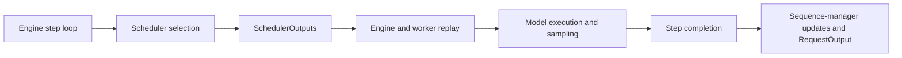

# LPServe Scheduler Architecture Summary

> **Phase C summary note.** This is a compact, implementation-facing summary of the Phase C architecture audit. The full evidence, classifications, source links, and revision boundary are in [`docs/lpserve_scheduler_architecture.md`](lpserve_scheduler_architecture.md). The normative LP-scheduler requirements are in [`docs/lp_scheduler_design.md`](lp_scheduler_design.md). If this summary conflicts with either document, the full audit governs descriptive framework behavior and the design file governs normative LP-scheduler requirements.

## 1. Scope and reader model

This document is for an implementer who needs a quick working model of the audited LPServe/SLAI-derived scheduler, engine, sequence, and memory pathways before reading the full audit. It is not a substitute for source inspection at the working revision, nor is it a mathematical specification. The Phase C claims describe the audit baseline at commit `c3e0143`; recheck affected code paths before relying on them if scheduler-relevant code has changed.

The intended implementation boundary is: a read-only Phase E mapper observes LPServe state, the framework-light Phase D layer solves and extracts a plan, and Phase F validates fresh native state before executing that plan.

## 2. High-level execution flow

LPServe has a central engine and scheduler plus one or more GPU workers. The central scheduler owns the authoritative scheduler collections and central block manager. The engine-side sequence manager shares central `Sequence` objects; workers hold serialized copies and local block managers. Synchrony is intended to come from replaying the same `SchedulerOutputs`, not by sending physical block tables.

At a normal step, the scheduler selects actions and mutates its collections and central block state before forward execution. It returns `SchedulerOutputs`: ignored IDs, preempted IDs, and a list of `SequenceScheduleMetadata` execution actions. The engine replays controls and scheduling metadata; workers replay the same actions while maintaining local block tables; the model runs; then completion pairs execution results with scheduled metadata. Completion pauses the sequence, advances prompt progress for prefill or appends a sampled token for decode, checks stopping rules, and removes finished sequences. The scheduler later frees finished central blocks and adjusts resident state.

The output object is an action description, not a state snapshot or a transaction: it lacks central physical block IDs, general integrity checks, and a cross-layer rollback mechanism.

## 3. Core scheduler-visible state

An LP scheduler needs an authoritative, coherent request universe rather than a convenient union of legacy collections. Status, collection membership, allocation, and execution readiness are related but are not interchangeable.

| State concept | LPServe/SLAI source | Why it matters |
|---|---|---|
| Waiting queue | `BaseScheduler.waiting` | Holds requests not yet admitted and recomputation returns; arrival and prompt-length checks affect eligibility. |
| Running/resident set | `running`, plus policy-specific ledgers | Existing policies use this differently; SLAI also has `_active_seq_ids`, `paused_prefills`, and `decode_queue`. |
| Prompt length | `Sequence.get_prompt_len()` / prompt tokens | Defines total prefill work and initial full-context allocation charge. |
| Processed prompt tokens | `get_num_prompt_tokens_processed()` | Prompt remainder is total length minus this value; negative or inconsistent values are invalid mapping state. |
| Prompt completion | `prompt_processing_finished` and remainder | Separates legal prefill from decode; completion occurs after a prefill pass. |
| Decode status | Prompt complete, resident/allocated, legal status/ownership | A zero metadata chunk encodes decode; it does not establish these prerequisites. |
| Ignored/finished sequences | `SequenceStatus` and engine sequence maps | Finished and ignored requests must not enter the LP universe or remain scheduler-owned. |
| Block allocation state | Central block manager `block_tables` | Distinguishes a zero-cost resident partial prefill from a full admission/recompute allocation. |
| Physical block table | `block_tables[seq_id]` | Gives current allocated blocks, exact preemption recovery, and decode marginal-gap information. |
| Scheduler ownership | New scheduler authoritative containers | Must be deduplicated and validated; base `waiting ∪ running` is incomplete for SLAI auxiliary ownership. |
| Pipeline/in-flight state | Pipeline engine counts and outstanding work | Multiple microbatches can be in flight; safe release and action ownership are unresolved. |

`WAITING`, `RUNNING`, and `PAUSED` are lifecycle states, not complete ownership proof. In particular, `is_executing()` covers `RUNNING` and `PAUSED`, but does not alone prove allocation, resident ownership, or pipeline safety.

## 4. Prefill, decode, and continuous batching behavior

`SequenceScheduleMetadata(seq_id, prompt_chunk_len)` is the execution-facing encoding. A positive `prompt_chunk_len` is prefill and specifies the prompt slice processed in that pass. Decode metadata uses `prompt_chunk_len=0` and represents one output-token action. The audited constructor also treats a negative chunk as decode-like, which is a validation gap, not an allowed LP representation. Zero is metadata encoding, never independent evidence that a request is eligible to decode.

Prompt progress is updated only on completion. Resident partial prefills remain allocated and can receive another positive chunk; when their remainder reaches zero, later scheduling can use decode. Sarathi-style continuous batching can mix decode and prefill under its policy budgets. That does not make every mixed batch safe: physical prompt-first input packing, metadata ordering, sampling type association, and positional completion impose additional constraints.

There is no universal native requirement that a prompt chunk be block-aligned. Logical blocks are pre-created for the full context; chunking slices prompt tokens. Existing dynamic chunk policies may choose alignment, but that is a policy decision rather than block-manager legality.

## 5. Memory and block-management behavior

KV-cache memory is represented as physical token blocks. The block manager owns a free-block allocator and `block_tables` from `seq_id` to physical blocks. Allocation has no contiguity requirement. A waiting admission allocates the full logical context before executing even a small positive prompt chunk; the admission gate includes its one-percent watermark. Consequently, shrinking a chunk does not shrink that fixed allocation cost.

A resident partial prefill normally needs no new physical blocks because its full logical context was allocated at admission. Decode differs. The next decode exact marginal demand is the logical-versus-physical block-table gap, normally zero or one. Existing `can_append_slot()` is more conservative: it requires a free block even when the exact gap is zero, and does not apply the admission watermark. Preemption frees the complete physical block table, recovering its current number of blocks.

The design document defines planning-memory quantities and their policy choices. Planning feasibility alone cannot prove native execution legality: it omits current allocator gates, watermark asymmetry, action disjointness, mutation order, worker replay, in-flight safety, and partial failure. Phase F must revalidate physical feasibility at the actual decision boundary.

## 6. Preemption and recomputation path

Native preemption is reset-and-recompute, not swapping. A legal executing resident is removed from the policy resident ownership, its central physical blocks are freed, and it is returned to the front of `waiting`. Replaying its preempted ID resets prompt progress, clears prompt completion, moves generated tokens into the prompt context, clears the current output-token list, and frees worker-local blocks. A later admission allocates the expanded full context and prefills it again.

This path preserves causal token context but has verified semantic defects. The generation limit reads the cleared current output list rather than the cumulative generation count, so restarts can permit overgeneration. After a restart, `RequestOutput` can combine original prompt text with expanded prompt token IDs and cumulative output text with only post-restart token IDs. Control-only preempt outputs are also broken: single-stage execution can drop them before replay, while pipeline execution can wait for a model result from a batch never sent. Operational preemption must remain disabled until the recomputation generation-limit, request-output, and control-output blockers are repaired and tested.

## 7. Scheduler output contract

`SchedulerOutputs` carries an iteration ID, ignored IDs, preempted IDs, `SequenceScheduleMetadata` entries, and some SLAI counters. Native replay orders controls as ignored, then preempted, then scheduled metadata. Preempted blocks can therefore become available to later actions in the same output. `SchedulerOutputs` itself does not guarantee that IDs are known, unique, disjoint, eligible, or consistent with counters; the LP execution boundary must supply those validations.

Positive metadata must be bounded by current prompt remainder and describe prefill; zero metadata must be emitted only for an already-validated decode. Ignored sequences must be handled as controls without colliding with scheduled or preempted IDs. A true no-op has all action/control fields empty; it differs from a control-only output.

For enabled mixed batches, physical inputs are prompt-first. The audit found that existing Sarathi scheduling can append decode metadata before prefill metadata, whereas input construction packs prompts first and downstream sampler/completion logic has ordering and identity weaknesses. The LP executor must use deterministic, replay-compatible order and must not claim support for mixed sampling cases until sampler identity and length association are validated.

## 8. Phase E implications for LP-state construction

Phase E is a read-only mapper, not a scheduling side effect. It must construct one immutable, internally coherent snapshot of scheduler-owned requests, statuses, progress, logical and physical blocks, free blocks, capacities, and supported in-flight markers. It must deduplicate by `seq_id`, validate that one authoritative owner covers every included arrived, non-finished request, and fail rather than silently merge contradictory objects or stale collections.

The mapper computes prompt remainder from audited sequence fields, checks prompt completion against it, and verifies allocation/residency before assigning zero resident-prefill admission cost or decode eligibility. It exposes allocator free-block count, logical block length, physical table length, and preemption recovery from block-manager state; it does not infer physical feasibility from a scalar plan. It also provides stable ordering keys so Phase D extraction can be deterministic. Future arrivals, finished requests, unsupported in-flight requests, inconsistent ownership, and contradictory allocation/progress state are mapping failures, not inputs to repair by mutation.

## 9. Phase F implications for native execution

Before mutation, Phase F must re-read plan-relevant state and reject stale ownership, status, allocation, progress, block, or in-flight state. It must validate the whole integer action plan before the first mutation: ID uniqueness/exclusion, eligibility, chunk bounds and positivity, resident limits, allocation and append gates, recovery, replay order, and supported output shape. It then uses native admission, resident-prefill, decode, and, only after blockers clear, preemption paths rather than inventing parallel state changes.

Prevalidation is necessary but not atomicity. The audited scheduler mutates collections and central blocks before worker replay and model execution, and has no transaction, reservation, undo log, or cross-layer rollback. Rollback or other post-mutation recovery remains OPEN. Unsupported control-only, pipeline-parallel, and affected mixed-batch/sampler behavior must remain blocked rather than being hidden by an unrelated scheduled action.

## 10. Implementation hazards checklist

- [ ] Do not assume `waiting ∪ running` is always the complete unfinished set.
- [ ] Do not confuse resident capacity (`max_num_seqs`) with scheduled-action width.
- [ ] Do not treat planning memory as native allocator feasibility.
- [ ] Do not impose artificial prompt block alignment.
- [ ] Do not treat zero `prompt_chunk_len` as proof of decode legality.
- [ ] Do not use operational preemption before recomputation and control-output blockers are fixed.
- [ ] Do not import SLAI `limit_total_decodes` as the LP action-width cap without mathematical revision.
- [ ] Do not assume pipeline support or safe in-flight physical release.
- [ ] Do not rely on solver-side fractional-count folklore as an extraction guarantee.
- [ ] Do not mutate queues, statuses, blocks, or prompt progress during Phase E.
- [ ] Do not rely on `SchedulerOutputs` to enforce uniqueness, disjointness, bounds, or replay safety.
- [ ] Do not mistake pause metrics for preemption counts.

## 11. References to full documents

Read [`docs/lpserve_scheduler_architecture.md`](lpserve_scheduler_architecture.md) for the full Phase C evidence, exact source paths, audit limitations, and verified defects. Read [`docs/lp_scheduler_design.md`](lp_scheduler_design.md) for the normative LP scheduler contract, OPEN decisions, and BLOCKER gates. Use [`docs/project_status.md`](project_status.md) for phase chronology and handoff state, and [`docs/LP Scheduler Research Context.md`](LP%20Scheduler%20Research%20Context.md) for research scope, validation discipline, and implementation process.
